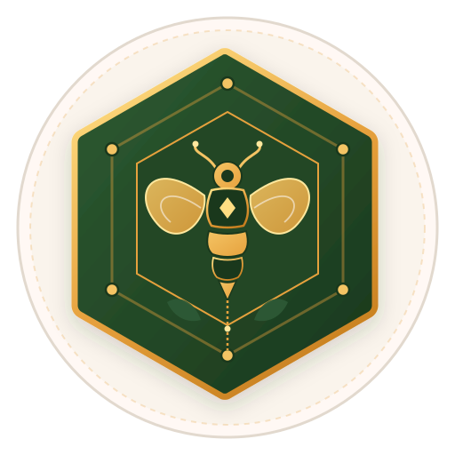

# HiveTrace — Bio-Canopy Grid

> **Forestry & Apiary Integrity System** | Built for SIH 2026 (Honeychain)

HiveTrace is a decentralized agro-cryptographic provenance and hive telemetry platform designed to protect endemic bee colonies and verify honey purity from forest canopy to retail jar.



---

## 🍯 Key Features

- **Beehive Management Dashboard**:
  - Live LoRaWAN telemetry monitoring for 142 active colonies across Sector B.
  - Multi-sensor cards tracking hive weight deltas, brood core temperatures (35°C), acoustic pitch frequencies, and super saturation levels.
  - Interactive status filtering (`All Colonies`, `Honey Flow`, `Brood Rearing`, `Attention Required`).
  - Integrated field operations checklist with persistent state.

- **Cryptographic Hive Inspection Log**:
  - Colony vitals and marked queen lineage evaluation.
  - Interactive **10-frame brood occupancy picker**.
  - Real-time super capacity slider linked to dynamic **radial SVG ripeness gauge**.
  - Biosecurity pathogen screening (Varroa destructor load counter, Small Hive Beetle, Foulbrood).
  - Hands-free voice dictation simulator and quick clinical observation tags.
  - **Local Storage Mock API**: Offline draft caching & immutable cryptographic audit sealing (SHA-256 digest generation).

- **Honey Traceability & Batch Verification**:
  - Multi-batch switcher (`AT-2024-08`, `AT-2024-07`, `AT-2024-06`) with query lookup.
  - 4-stage verified provenance timeline (Foraging, Cold-Centrifuge Extraction, NABL Lab Assay, Blockchain Seal).
  - Melissopalynological pollen spectrum analysis (Wild Blackberry, Acacia, Clover).
  - Official Certificate of Analysis with 6 bio-chemical indices (Diastase activity, HMF, C4 sugar IRMS test).
  - Public Digital Product Passport with high-contrast QR code and simulated NFC smart cap tap.

- **Master Apiarist Profile & Operational Controls**:
  - Field ranger credentials and ISO 17025 certification overview.
  - State-managed toggle switches for telemetry cloud sync, offline draft autosave, biosecurity enforcement, and weather alerts.
  - Local database export (JSON) and backup tools.

- **Authentication Gateway**:
  - Dual-role authentication switcher (Apiarist / Field Ranger vs. Auditor / Lab Partner).
  - Direct public traceability lookup without login.

---

## 🛠️ Architecture & Tech Stack

- **Frontend**: Vanilla HTML5, Vanilla JavaScript (ES6+ Modules), Vanilla CSS3 (Custom Properties & Design Tokens).
- **Design System**: Tailored HSL palette extracted from Stitch MCP design mockups (`#845400`, `#1E3F20`, `#FAF6F0`, `#C52020`).
- **Typography**: Google Fonts (*Epilogue*, *Manrope*, *JetBrains Mono*), Material Symbols Outlined.
- **State Management**: Reactive in-browser store with event emitter system backed by `localStorage`.
- **Routing**: Single Page Application (SPA) hash router with enter animations and auth guards.

---

## 🚀 Getting Started

No build tools or heavy package installations required. Simply serve with any HTTP server:

### Using Python:
```bash
python -m http.server 8080
```
Open [http://localhost:8080](http://localhost:8080) in your browser.

### Using Node.js:
```bash
npx serve .
```

---

## 📁 Repository Structure

```
├── assets/
│   └── logo.svg                 # Vector brand emblem (Hexagon shield & heraldic bee)
├── js/
│   ├── components/
│   │   ├── header.js            # Sticky navigation & search bar
│   │   └── toast.js             # Toast notification system
│   ├── pages/
│   │   ├── dashboard.js         # Telemetry command center
│   │   ├── inspection.js        # Multi-section inspection audit form
│   │   ├── login.js             # Auth gateway & role switcher
│   │   ├── settings.js          # Profile & toggle switches
│   │   └── traceability.js      # Provenance ledger & lab certificates
│   ├── app.js                   # Application bootstrap
│   ├── router.js                # Hash SPA router
│   └── store.js                 # Reactive localStorage state store
├── index.html                   # HTML entrypoint
├── styles.css                   # HiveTrace design system stylesheet
├── .gitignore                   # Ignored files
└── README.md                    # Project documentation
```

---

## 📜 License

Created for Smart India Hackathon (SIH 2026) — Honeychain Prototype.
